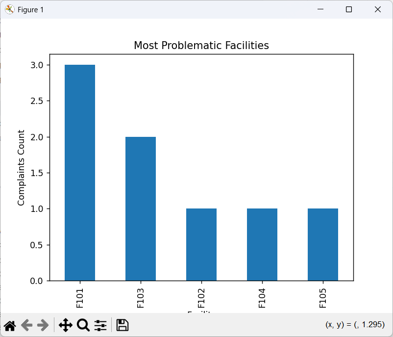
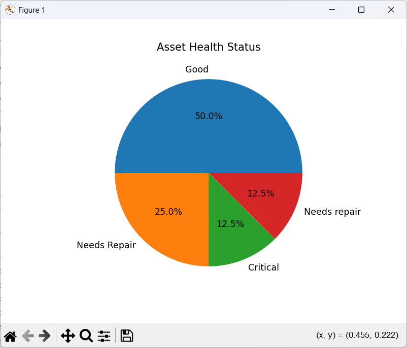

# Smart Campus Navigation, Facility Monitoring & Resource Analytics System (SCN-FMRA)

👥 Team Members

* Kalangi Nikitha (2500031037)
* Ch. Vennela (2500031042)
* P. Lavanya (2500031010)
* M. Lokesh (2500031038)

 Description

The Smart Campus Navigation, Facility Monitoring & Resource Analytics System (SCN-FMRA) is a Python-based application designed to improve campus efficiency. It enables users to navigate campus locations, manage facility bookings, track complaints, and analyze resource usage through data-driven insights.

 Features

* 📍 Campus navigation using BFS algorithm
* 📅 Facility booking system with conflict detection
* 🛠 Complaint and maintenance tracking
* 📊 Data analysis using Pandas & NumPy
* 📈 Visualization using Matplotlib

 Technologies Used

* Python
* Pandas
* NumPy
* Matplotlib
  
 How to Run

1. Install required libraries:
   pip install pandas numpy matplotlib

2. Run the program:
   python main.py
   
 Project Structure

scnfmra/
├── __init__.py
├── main.py

├── models/
│   ├── facility.py
│   ├── booking.py
│   ├── complaint.py
│   └── asset.py

├── analysis/
│   └── analytics.py

├── visual/
│   └── charts.py

├── utils/
│   └── navigation.py

├── data/
│   ├── bookings.csv
│   ├── complaints.csv
│   └── assets.csv

└── README.md

 Visualizations

 Booking Analysis

Complaint Trends

 📉 Asset Distribution

 Facility Usage Analysis

Campus Navigation (BFS Path)

Conclusion

This project demonstrates how data structures, algorithms, and data analytics can be integrated to build an efficient smart campus management system.
